# PurpleHaze - Air Quality Monitor

*PurpleHaze* is a simple Air Quality Monitor based on the [Plantower PMS5003](https://www.adafruit.com/product/3686). You put together some electronics, 3D-print a case, load this software, configure an app on your phone, and you're all set. What could be simpler? This software uses the [Blynk](https://blynk.io) service to collect data in the cloud and make it available to the app on your phone. If you don't want to use Blynk, you can get the readings directly from *PurpleHaze* in your web browser. In the future, other services may be supported.

The air quality monitor is configured using a Web User Interface where the user will specify information such as:

* The location of the air quality monitor
* API keys for the underlying services (like Blynk)
* etc.

Some of this configuration information is specific to *PurpleHaze* while other information is common to any web-connected device. You can learn more about such `WebThing`'s [here](https://github.com/jpasqua/WebThing).

## Dependencies

### Libraries
The following third party libraries are used within this project:

* [Adafruit NeoPixel](https://github.com/adafruit/Adafruit_NeoPixel)
* [Arduino-Log](https://github.com/thijse/Arduino-Log)
* [ArduinoJson (v6)](https://github.com/bblanchon/ArduinoJson)
* [BlynkSimpleEsp8266](https://github.com/blynkkk/blynk-library)
* [CircularBuffer](https://github.com/rlogiacco/CircularBuffer)
* [ESPTemplateProcessor](https://github.com/jpasqua/ESPTemplateProcessor)
* [TimeLib](https://github.com/PaulStoffregen/Time.git)
* [WebThing](https://github.com/jpasqua/WebThing) [version 0.2.0 or later]

The following libraries are used in the browser. You do not need to download or install them. They are listed here because if you are doing further development of the browser code, you may need to understand their usage:

* [Chart.js](https://www.chartjs.org)
* [JQuery](https://jquery.com)

### Services
The following services play a role in providing parts of the functionality:

 - [Blynk](https://blynk.io): Provides a repository of air quality data and the ability to view it using a mobile app. If you decide not to use Blynk, you can still view data directly using a web browser.
 - Services used by WebThing
	 - [Google Maps](https://developers.google.com/maps/documentation): Used for geocoding and reverse geocoding. Though not absolutely necessary, it does make using the system a bit more convenient.
	 - [TimeZoneDB](https://timezonedb.com): Used to get local time and time zone data. This is used to timestamp data. It is necessary for the operation of *PurpleHaze*.

<a name="organization"></a>
## Organization

### Directory Structure
The directory structure of the project is shown below. You don't need to know this to build and use the project, but if you want to work on it, this will give you an idea of where everything is located.

````
    PurpleHaze
        [Primary Source files including PurpleHaze.ino]
        /data
            [HTML page templates for PurpleHaze]
            /wt
                [HTML page templates for WebThing]
        /doc
            /images
                [images used in the documentation, not by the code]
        /resources
            [Other resources such as a PCB design]

````

### Code Structure

The primary functional areas of *PurpleHaze* are given below. You don't need to know this to build and use the project, but if you want to work on it, this will give you an idea of where the different functionality is implemented.

* `PurpleHaze`
	* The primary logic for the application. It holds various objects, like the settings, that are available throughout the project. `PurpleHaze` uses the `WebThing` framework and follows the organization it defines for the setup and loop functions.
* `PHWebUI`
	* Implements the Web UI for *PurpleHaze* which primarily consists of pages that allow the user to view and update the settings of the device. When settings change in the Web UI, it calls back into the core of the code to have those changes reflected. 
	* **NOTE**: Currently the real-time handling of changes is not very thorough. Many changes require a reboot to take effect.
* `AQIReader`, `PMS5003`
	* `PMS5003` is the low level interface to the PMS5003 sensor. It is adapted from a couple of different libraries. See the source code for details.
* `HWConfig.h` is used to provide configuration information related to the *PurpleHaze* hardware. Please ensure that the definitions in this file match your actual hardware configuration.

<a name="building-PH"></a>
## Building PurpleHaze

*PurpleHaze* has been built and tested with Arduino IDE 1.8.10 and ESP8266 cores 2.6.1 and 2.7.1. Newer versions are likely to work, but I haven't tried other specific combinations. If you have never built an Arduino project using an ESP8266, you'll need to [prepare your development environment](https://github.com/esp8266/Arduino#installing-with-boards-manager). 

### Hardware

#### Configuring Your Hardware

The primary components of this project are a [Plantower PMS5003](https://www.adafruit.com/product/3686) sensor and an ESP8266 such as a Wemos D1 Mini (but virtually any ESP8266 will work). You can optionally add a few WS2812 LEDs (commonly known as NeoPixels) for status readouts if you'd like.

In its simplest form, *PurpleHaze* is simply an ESP8266 connected to the PMS5003 sensor with 2 pins used for serial communications along with power (5V and ground). Logic levels between the PMS5003 and the ESP8266 are 3.3V.

All of the components can be wired together point-to-point, or assembled onto a protoboard as shown in the image below. The [attached schematic](doc/images/Schematic.svg) shows the wiring. The NeoPixel LEDs are optional. If you are *not* using the LEDs, set `NEOPIXEL_PIN` to `-1` in `HWConfig.h`.

[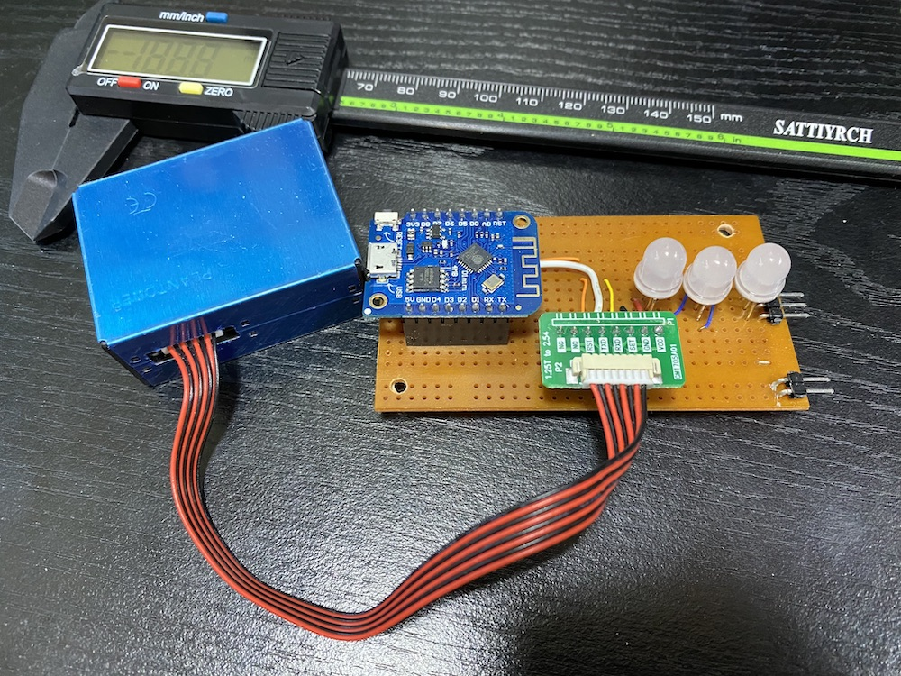](doc/images/Protoboard.jpg)

A PCB design is also available in the resources directory. As can be see in the images below, it is really nothing more than a consolidated place to mount a Wemos D1 Mini, the connector for the PMS5003 cable and WS2812D indicator LEDs such as [these](https://www.aliexpress.com/item/32847283594.html).

Notes on the LEDs:

* Be careful - there are LEDs that look the same but whose pins are in a different order. If you are using the PCB, make sure you have LEDs whose pins are ordered: `Dout`, `Vcc`, `GND`, `Din`
* You'll notice that the LEDs have a flat spot on one side of the base. Align that flat spot to the flat spot shown on the PCB. Refer to the images below.

The D1 Mini can be mounted on the top of the board as shown in the image, or below the board with the headers on the top of the D1 rather than the bottom. In the 3D model you'll find that the D1 is mounted on the bottom. The same is true for the sensor header.

[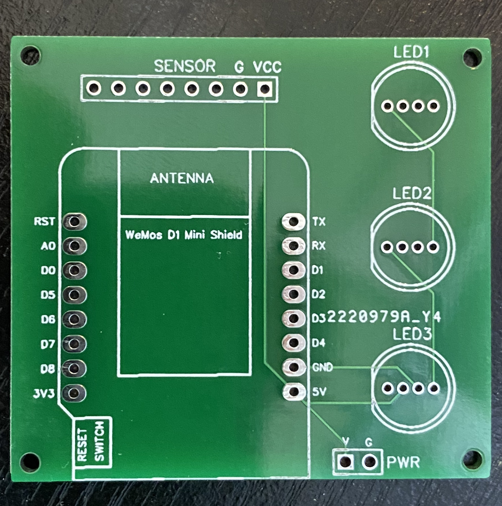](doc/images/PCB_Bare.jpg)
[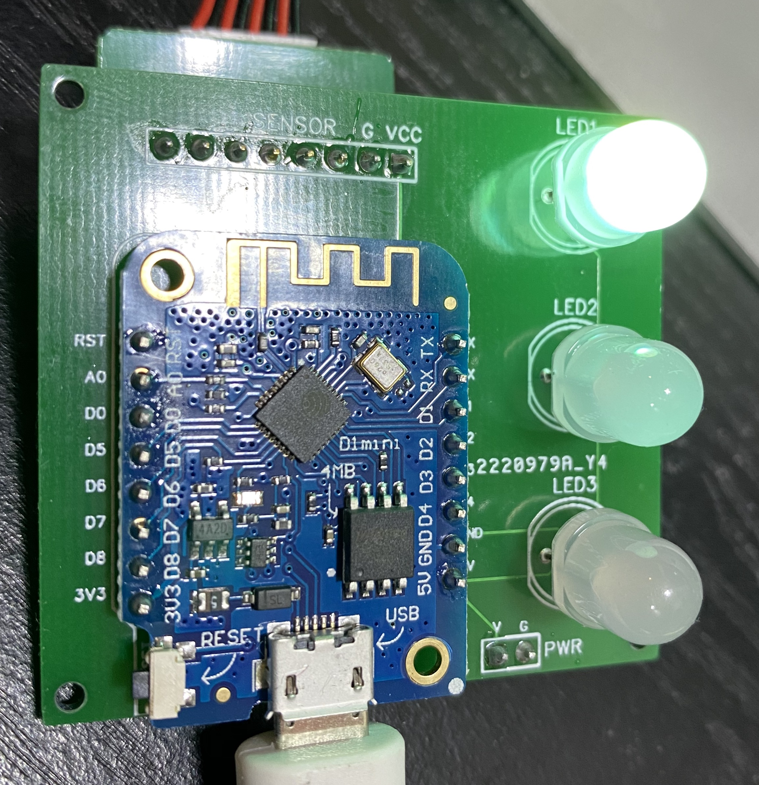](doc/images/PCB_Populated.jpg)

Speaking of the sensor header, it is there for use with the adapter board that comes with the Adafruit sensor and is also available form [aliexpress](https://www.aliexpress.com/item/33040162499.html). You can bypass that board completely by cutting the connector off one end of the cable and soldering the wires directly to the board in place of the sensor header. Only four wires from the cable are needed: `VCC`, `GND`, `TX`, and `RX`.

The 3D Model for the housing has a bracket that is designed to work with this PCB. You can use a service like [OSH Park](https://oshpark.com/) or [JLCPCB](https://jlcpcb.com) to fabricate the board by uploading the design which is a single zip file containing the [Gerber](https://en.wikipedia.org/wiki/Gerber_format) files.


### 3D Model

A housing for *PurpleHaze* is [available on thingiverse](https://www.thingiverse.com/thing:4607364). It contains an internal mounting system that is designed to work with the PCB mentioned above. The 3D model is included so it can be modified to hold other configurations of the electronics.

[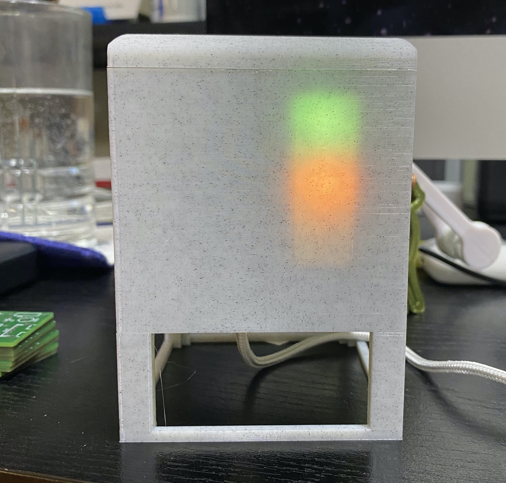](doc/images/Housing/H2.jpg)
[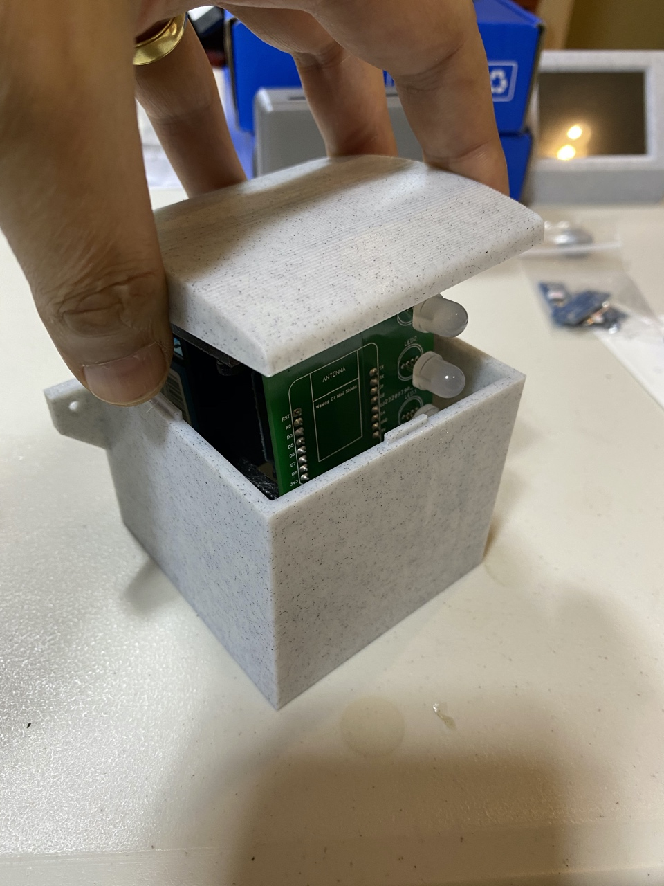](doc/images/Housing/H1.jpg)
[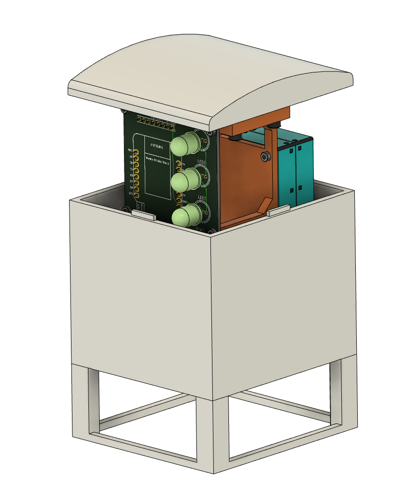](doc/images/Housing/H3.png)

**NOTE**: If you use the [Adafruit version of the PMS5003](https://www.adafruit.com/product/3686) with their adapter board, you will probably want to bend the pins on the that board 90° to make it work well in this housing. The adapter that is available from [aliexpress](https://www.aliexpress.com/item/33040162499.html) is already in this orientation.

<a name="software"></a>
### Software
Building the software for *PurpleHaze* is a bit more complex than a typical application because it stores files on the ESP8266 file system. This means that you need to use a plug-in to the Arduino IDE to upload those files to the Arduino. The file structure is described in detail in the [*WebThing*](https://github.com/jpasqua/WebThing) readme file. In this section I will describe the steps involved.

1. Download and install the [`ESP8266 Sketch Data Upload`](https://github.com/esp8266/arduino-esp8266fs-plugin) plug-in. Note that installing this plugin is not the same as installing a normal Arduino library. Follow the installation instructions [here](https://github.com/esp8266/arduino-esp8266fs-plugin#installation). If you have installed successfully, you will see a new menu item in the Arduino IDE Tools menu. See the screen shot below.
2. Copy or link the `wt` directory from [*WebThing*](https://github.com/jpasqua/WebThing) `data` directory to the *PurpleHaze* `data` directory. When you're done you'll have a `data` directory that contains a number of `HTML` files and a `wt` subdirectory. The `wt` subdirectory will also contain `HTML` files.
3. You need to reserve some flash memory space for the file system. In the Tools menu of the Arduino IDE you will see a `Flash Size` submenu. Choose `FS: 1MB`.
4. Now connect your ESP8266 to your computer via USB and select the `ESP8266 Sketch Data Upload` item from the tools menu. You will see all the files in your `data` directory, including those in the `wt` subdirectory being loaded onto your ESP8266.
5. Finally you can proceed as usual and compile / upload *PurpleHaze* to your ESP8266.

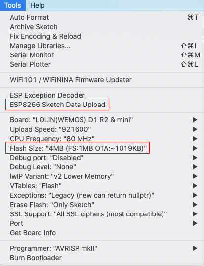

## Setting Up PurpleHaze

### Getting Started with Configuration

Before you get started, you will need API keys for the services mentioned above (Google Maps, TimezoneDB, and Blynk). All are free. Please go to each site, create a key, and keep track of them. You'll need to supply them during the configuration process. Technically, you don't need a Google Maps key. Without it you'll need to look up the latitude and longitude of your location on your own and enter them into the Web UI. You also don't need a Blynk key if you just want to get the sensor reading from the Web UI, not an app on your phone. You do need a TimezoneDB key so *PurpleHaze* can keep track of the time of the readings.

<a name="connecting-to-your-network"></a>
### Connecting to your network
Once you have assembled your hardware and loaded the firmware, the monitor will boot and create its own WiFi access point. Connect to the new access point you will see on your phone or computer's wifi connection list. It will have an SSID of the form `ph_NNNNN`. Once you do, you will enter a "captive portal" where you can configure the device for your actual WiFi base station. Shortly after you've done that, *PurpleHaze* will automatically connect to your wifi network. If it does not, then power cycle the device.

At this point it will make a web interface available. You can connect using either an IP address or a hostname:

- **IP Access**: You need to determine the IP Address used by the device. You have a couple of choices here:
    - If you are still connected via USB, you will see the IP address in the Arduino Serial Monitor
    - You can use a scanning tool or your router to look for the device on your network
- **Hostname**: If your system supports mDNS (e.g. a Mac or a Raspberry Pi running avahi) you can connect to hostname.local in your browser. Hostname will be of the form `ph_NNNNN`.


### Configuring PurpleHaze

Once connected, you can use the web interface to configure a few parameters of your monitor. You get to the settings by selecting an item from the [hamburger menu](https://en.wikipedia.org/wiki/Hamburger_button) in the top left of the web page. Before getting to settings that are specific to *PurpleHaze*, you need to configure some general information for your web-connected device including a username / password. You do this using the *General Settings* menu item as described below.

<a name="general-settings"></a>
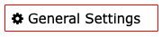  

These settings are common to many network connected devices and are encapsulated by the [*WebThing*](https://github.com/jpasqua/WebThing) library. The settings you must configure are listed below in the order you will want to enter them on a new device. In general, once you have entered the General Settings once, you won't need to change them again. When you are setting up your device for the first time, you will need to enter some of the settings, save, and reboot before you can enter the rest. In particular, you'll need to enter the API keys before you can geolocate your address.

* **API Keys**: You need these keys to be entered in order to use the location options below and to have the time set.
	* [Google Maps](https://developers.google.com/maps/documentation/javascript/get-api-key): Fill in the api key you acquired from for the Google Maps service
	* [TimeZoneDB](https://timezonedb.com/api): Fill in the api key you acquired from for the TimezoneDB service. Note: NTP is perhaps a more natural choice for a time service, but it does not incorporate a mechanism for time zone determination. TimeZoneDB allows WebThing to get the time, time zone, and local time without need for another mechanism. **Note** that these keys will not be active until after you have saved them and rebooted the device.
* **Username / Password**: The username / password you'll use when you connect to *PurpleHaze*. This is not the same as any username/password you use to log into your printers. It defaults to admin/password. ***You should change these*** the first time you configure *PurpleHaze*.
* Web Server Settings:
	* **Hostname**: A network name for your *PurpleHaze* device. If you configure a name such as `PH`, then you can access your device from a browser using the address `http://PH.local` rather than using the IP address. This only works on systems that have support for mDNS. This is native on Macs but can be added to Linux and Windows with software such as [Avahi](https://github.com/lathiat/avahi).
	* **Port**: The port that *PurpleHaze* will listen on. Usually 80 unless you've got a good reason.
* Location Settings:
	* **Latitude, Longitude, Elevation**: In *PurpleHaze*, these are only used to determine your time zone (for this purpose elevation is not important).
	* **Address** / Geocode: Since you probably don't know your lat/lon and elevation, enter an address in the Address field and press the Geocode button. Assuming you have already saved your Google Maps API key, the address will be translated to lat/lon and elevation. If you prefer not to create a Google Maps key, you can find your lat/lon manually as [described here](https://support.google.com/maps/answer/18539).
* **Theme Color**: Choose a theme for the Web UI that suits your style. The themes are all from the [W3.CSS](https://www.w3schools.com/w3css/w3css_color_themes.asp) set.
* **Indicator LED**: Ignore this section. *PurpleHaze* has a more flexible [indicator LED capability](#indicators).

<a name="configure-PH"></a>
 

Now that the General Settings are out of the way, you can adjust settings that are specfic to *PurpleHaze*:

- **Description**: A description that is useful to the user. For example, the location of the device like "Back Yard" or "Inside".
- **Blynk API Key**: An API key established by the user when configuring the Blynk app.
- **Indicator Brightness**: If your device incorporates indicator LEDs, this sets their brightness in the range from 0-100%.
- **Chart Colors**: The [charts page](#charts) shows historical data in the form of line charts. Each chart shows four lines: pm10, pm25, pm100, and AQI. You can customize the colors of the lines. The background of the chart displays color bands that correspond to the air quality (green, yellow, and various shades of red). These colors can be changed in `data/ChartPage.html`, but not in the Web UI.


## Using PurpleHaze

*PurpleHaze* lets you view your air quality data on your phone or with a web browser. But what do all these numbers mean? There are many resources available to help you understand the data; for example, [this page](https://www.epa.gov/pm-pollution/particulate-matter-pm-basics) on the US EPA website. The following table summarizes the air quality index values at a high level (adapted from [AirNow.gov](https://www.airnow.gov/aqi/aqi-basics/)).
<a name="color_code"></a>

|Color|Concern|Range|Description of Air Quality|
|--- |--- |--- |--- |
|  |Good|0 to 50|Air quality is satisfactory, and air pollution poses little or no risk.|
|  |Moderate|51 - 100|Air quality is acceptable. However, there may be a risk for some people, particularly those who are unusually sensitive to air pollution.|
| |Unhealthy for Sensitive Groups|101 - 150|Members of sensitive groups may experience health effects. The general public is less likely to be affected.|
| |Unhealthy|151 - 200|Some members of the general public may experience health effects; members of sensitive groups may experience more serious health effects.|
| |Very Unhealthy|201 - 300|Health alert: The risk of health effects is increased for everyone.|
| |Hazardous|301+|Health warning of emergency conditions: everyone is more likely to be affected.|

The colors shown above are used on the [home page](#home) of the Web UI and on the [charts page](#charts). The air quality NeoPixel also displays one of these colors to show you the current AQI.

*PurpleHaze* uses a fairly simple algorithm to determine AQI based on sensor data. This algorithm is not "certified" in any way and you should **NOT** depend on it for any health related matters. The algorithm used by *PurpleHaze* is similar to the method described in [this wikipedia article](https://en.wikipedia.org/wiki/Air_quality_index#Computing_the_AQI). However, the actual conversion table is taken from the paper ["Measurements of PM2.5 with PurpleAir under atmospheric conditions"](https://amt.copernicus.org/preprints/amt-2019-396/) and it's [supplement](https://amt.copernicus.org/preprints/amt-2019-396/amt-2019-396-supplement.pdf). 

### Viewing PurpleHaze data on your phone

To use your phone, you'll need the Blynk App for [iPhone](https://itunes.apple.com/us/app/blynk-control-arduino-raspberry/id808760481?ls=1&mt=8) or [Android](https://play.google.com/store/apps/details?id=cc.blynk). Follow these steps to get going:

1. Download the appropriate app using the links above.
2. Open the Blynk app and create a new Blynk account if you don't have one already.
3. Touch the QR code icon at the top of the screen.
4. Scan the QR code below. This will load the AirQuality Monitoring configuration which you may customize if you wish using the Blynk app (no coding required).
5. Blynk will send you an "Auth Token" via email. Enter this in the settings screen of the web interface in the field labeled "Blynk API Key". Hit save and restart the device.
6. Use the Blynk app to see current and historical values.

Blynk QR Code:<br></img><br>

### Viewing PurpleHaze data in your browser

<a name="home"></a>
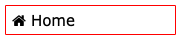

You're already familiar with the Web UI since you used it to configure *PurpleHaze*. Whenever you navigate to *PurpleHaze* in your browser, you will be presented with a home page that shows a variety of current and historical data from your monitor. Refer to the resources above to understand what all these values mean. The elements of the page are as follows:

* **PurpleHaze Data**: This is just a heading, but also shows the time of the last reading taken by the device
* **AQI** (Air Quality Index): The current AQI reading and the associated color code for that level. If you hover over this area you'll see some text describing the level.
* **Sensor Readings**: The most recent standard and environment readings of PM1.0, PM2.5, and PM10.0. The heading of this section includes two links labeled "charts" and "Satellite Image". You can also access charts [via the menu](#charts). If you click the "Satellite Image" link, a new window or tab will open with a satellite image centered over your location; i.e., the location you entered in the Web UI. This view is useful to visualize any major events (e.g. fires) that may be impacting your air quality.
* **Particulate Counts**: The raw particulate counts for particles of various sizes.
* Moving averages: The average PM25 Environment values for the last 10 minutes, 30 minutes, hour, and 6 hour periods. 
* **Area Readings**: A widget from [AirNow.gov](airnow.gov) that shows data for your area. Note that this data does not reflect the reading of your device.


<a name="charts"></a>
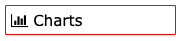

The Charts page provides several charts with historical data. In each chart you will see a line for PM10, PM25, and PM100 data. The charts cover three different time frames: the last hour, the last day, and the last week. Hover your mouse over a dot on the chart to see the precise value and time it was recorded. For any of the charts, if you click on the legend of one of the lines, it will toggle that line's visibility in the graph. For example, if you just want to see the PM25 day, click on the legend items for PM10 and PM100 and those lines will disappear. Click them again and they will return.

Note that when you first turn on your device, there will be no historical data so the charts won't be very interesting. Over time they will fill up with data.

[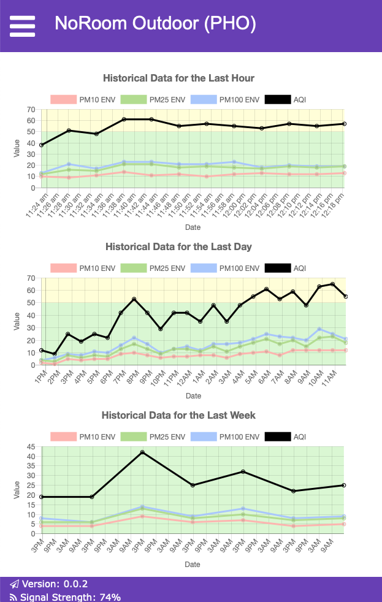](doc/images/ChartPage.png)


<a name="indicators"></a>
### Viewing the Indicator LEDs

If you have added indicator LEDs, they will display information as follows:

| LED        	| Color              	| Description
|------------	|--------------------	|-------------------------------------
| 1: Quality 	| Off                	| No power to the device
|            	| Gray               	| No data has been read yet 
|            	| Green, Yellow, Red, Purple, Maroon 	| The shade indicates the air quality as [defined above](#color_code)
| 2: Sensor  	| Off                	| Sensor is asleep
|            	| Yellow             	| Sensor is waking up
|            	| Green              	| Sensor is awake
|            	| Purple             	| Stabilizing                         
| 3: Status  	| Off                	| No activity
|            	| Red                	| Problem initializing
|            	| Blue               	| No wifi has been configured
|            	| Green              	| Processing readings

<a name="dev-info"></a>
## Operational Info for Developers

### Developer Endpoints and the Developer Menu

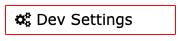 

There are a number of web endpoints for developers that can help with extending and debugging *PurpleHaze*. Each of the endpoints is listed below. Though it is not normally part of the main menu, you can get to an additional page of options by entering the url `http://[PH_Address]/dev` into your browser. Once you go to that page, you'll get an option to enable the Developer menu item which will make it easier to get to in the future.

Internally this has the effect of changing the value of the `showDevMenu` setting. If you prefer to have the Developer menu on by default, you can edit `PHSettings.h` and initialize  `showDevMenu` to `true`.

**Viewing your settings**

It can sometimes be useful to see all the settings in their JSON representation. The `/dev` page has a `View Settings` button which will return a page with the JSON representation of the settings. You can also get to this page directly with the url `http://[PH_Adress]/dev/settings`. If you save these settings as a file named `settings.json` and place it in your `data` directory, it can be uploaded to your device using `ESP8266 Sketch Data Uploader`. There is no need to do this, but developers may find it useful to easily switch between batches of settings.

The `/dev` page also has a `View WebThing Settings` button which will return a page with the JSON representation of the WebThing settings. This includes things such as the hostname, API keys, and the web color scheme.

**History**

As mentioned above, *PurpleHaze* periodically saves historical information to flash memory. You can see that data in JSON format by pressing the `View History` button. You can also get to this data directly with the url `http://[PH_Adress]/getHistory?range=combined`. You can also get just the hour-data, day data, or week data by substituting `hour`, `day`, or `week` as the range.

**Rebooting**

Finally, the `/dev` page also has a `Request Reboot` button. If you press the button you will be presented with a popup in your browser asking if you are sure. If you confirm, your *PurpleHaze* device will immediately reboot as if the reset button had been pressed.

### Tips

**Settings**

During development you may be uploading sketch data from time to time. When you do this, it overwrites the entire SPIFFS file system on the ESP8266. This means any settings that you have customized through the web interface will be wiped out. This gets annoying, but you can work around it in two ways:

1. [Not Recommnded] Change the *PurpleHaze* code and the WebThing library to hard-wire your default settings.
2. [Recommended] Configure *PurpleHaze* the way you like it. From the developer menu, click on the `View Settings` button to get your settings as JSON. Save the text into a file named `settings.json` and put it into your data directory. Do the same thing by pressing the `View WebThing Settings` button and save that text into `data/wt/settings.json` From that point forward, any time you upload sketch data, your preferred settings will be uploaded also.

**History**

The monitor itself will keep a relatively small amount of historical data on the device. This data is preserved across reboots or power outages. Specifically, every 10 minutes *PurpleHaze* saves the historical data for the last hour (with readings every 5 minutes), the last day (with readings every hour), and the last week (with readings every day).

Uploading new versions of the code will not overwrite the history, but uploading new data files will. You can preserve your history in similar way as just described for settings. From the developer menu, click on the `View History` button. This will return your history as JSON. Save the text into a file named `history.json` and put it into your data directory. When you upload sketch data, the history will also be uploaded.

**Indicators**

You can use the indicator LEDs to help you debug if you are not connected to the serial monitor. You can give limited status information by setting any of the indicators to a specific color to indicate what state the device is in.

**Rebooting**

When you need to restart the device, it is best to power cycle your ESP8266 and PMS5003 rather than just hitting the reset button. I've noticed situations where the ESP has a hard time resyncing with the sensor after a reset (as opposed to a power-cycle).
